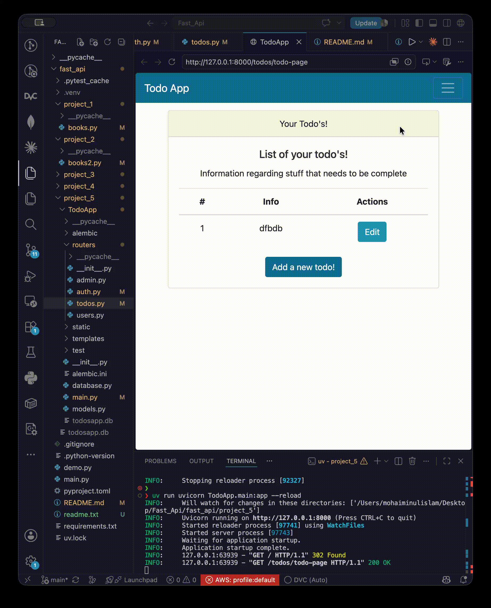

# FastAPI Learning Journey

This repository documents my FastAPI learning journey through a series of progressively more advanced projects. Each project builds on the previous one, introducing new concepts and increasing in complexity.

## Environment

This project uses [**uv**](https://docs.astral.sh/uv/) for dependency and environment management.

Install the project dependencies with:

```bash
uv sync
```

Or, if you're working from a `requirements.txt` file:

```bash
uv pip install -r requirements.txt
```

## Projects

### Project 1 — Basic CRUD API

- Basic CRUD API
- FastAPI fundamentals
- Simple REST endpoints

### Project 2 — Request Validation

- Request validation using Pydantic
- CRUD operations with request models
- Better API design

### Project 3 — Authentication & Database

```
TodoApp/
├── main.py
├── database.py
├── models.py
└── routers/
    ├── auth.py
    ├── users.py
    ├── todos.py
    └── admin.py
```

- API routing with `APIRouter`
- JWT authentication and authorization
- Database integration using SQLModel/SQLAlchemy
- User management

### Project 4 — Migrations & Testing

- Database migrations with Alembic
- Endpoint testing with Pytest and FastAPI `TestClient`
- Improved project structure and testing practices

### Project 5 — Full-Stack Todo App

- Simple frontend built with HTML, JavaScript, and Jinja templates
- User authentication using JWT
- Todo management through a web interface
- Frontend communicating with FastAPI REST endpoints

## Running a Project

Each project is self-contained.

1. Navigate to the desired project directory.
2. Start the FastAPI application:

   - **Project 1, 2**:
     ```bash
     uv run uvicorn books:app --reload
     ```
   - **Project 3, 4, 5**:
     ```bash
     uv run uvicorn TodoApp.main:app --reload
     ```

## Demo




## Learning Progression

The projects are intentionally organized from beginner to intermediate level, with each project introducing new FastAPI concepts while reinforcing previous ones.

Topics covered include:

- FastAPI fundamentals
- CRUD APIs
- Pydantic models
- Routing with `APIRouter`
- JWT authentication
- SQLModel
- Alembic database migrations
- API testing with Pytest
- Jinja templates
- HTML and JavaScript integration
- Building a complete Todo application